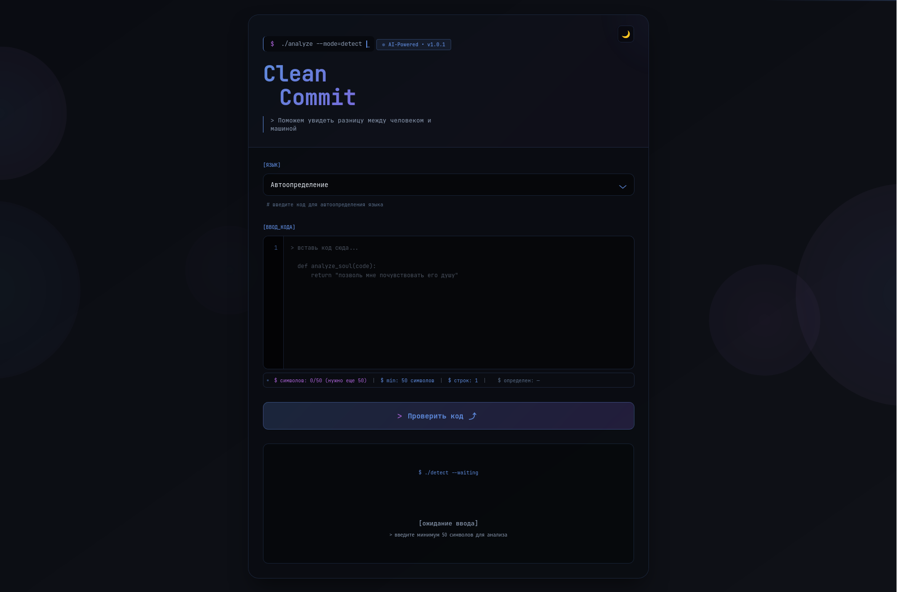

# Clean Commit

[](https://golang.org/)
[](https://www.python.org/)
[](LICENSE)
[]()

**Clean Commit** — AI-powered сервис для определения, был ли код написан человеком или сгенерирован искусственным интеллектом.

<p align="center">
  
</p>

## Возможности

- **Точность 97.6%** — XGBoost модель обучена на 10,000 образцах
- **4 языка** — Python, Java, C, C++
- **2 темы** — светлая и тёмная (терминальный стиль)
- **Быстрый анализ** — <100ms на запрос
- **Подробные метрики** — энтропия, строки, комментарии

## Быстрый старт

### Требования
- Go 1.20+
- Python 3.8+
- 100 MB RAM

### Установка и запуск

```bash
git clone https://github.com/JustDamir/clean-commit.git
cd clean-commit

chmod +x start.sh
chmod +x python_service/start.sh

./start.sh
